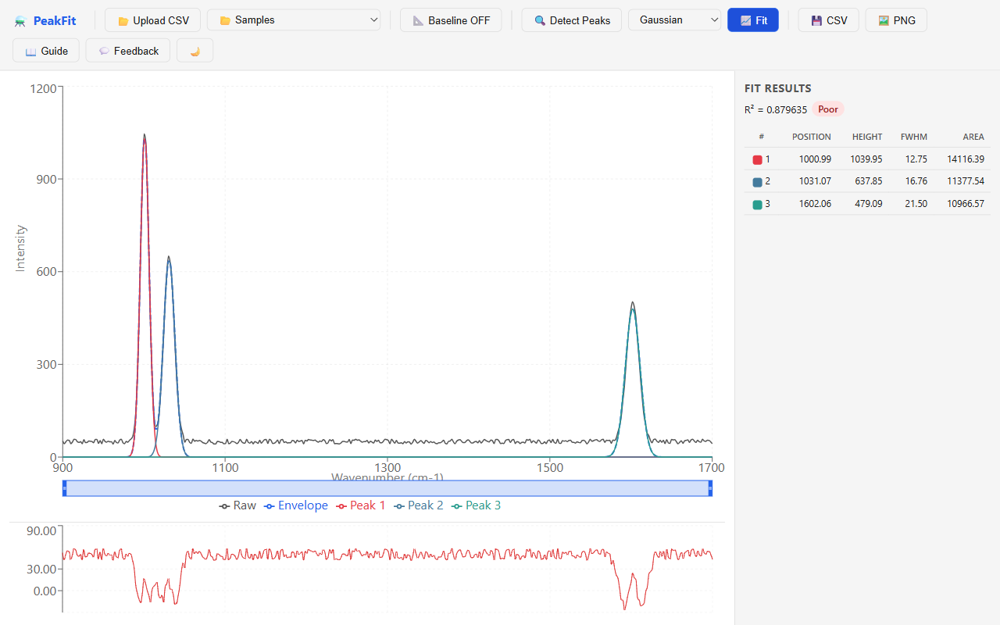

# PeakForge

**Free, web-based spectroscopy peak fitting — the modern replacement for legacy PeakForge software.**

Upload a Raman, FTIR, or XPS spectrum and get automatic peak detection, deconvolution, and publication-ready results in seconds.



---

## Features

- **CSV Upload** — paste or drag-and-drop spectra (wavenumber/wavelength vs intensity)
- **Automatic Baseline Correction** — linear or polynomial (degree 2–5)
- **Peak Detection** — prominence-based local-maxima finder with MAD noise estimation
- **Multi-Peak Fitting** — simultaneous Levenberg-Marquardt optimization of N peaks
- **Gaussian / Lorentzian / Voigt Profiles** — choose per fit or let auto-select
- **Interactive Chart** — zoom, pan, draggable peak markers, residual plot
- **Results Table** — position, height, FWHM, area, shape factor, and R²
- **Export** — download peak parameters as CSV, chart as PNG/SVG

---

## Quick Start

```bash
# Prerequisites: Node.js ≥ 18, pnpm
pnpm install
pnpm build        # build engine + web
pnpm dev           # start dev server (http://localhost:5173)
```

Run the test suite:

```bash
pnpm test
```

---

## Key Equations

### Gaussian

$$G(x) = H \exp\!\left(-4\ln 2\;\frac{(x - x_0)^2}{w^2}\right)$$

$$\text{Area} = H \cdot w \cdot \sqrt{\frac{\pi}{4\ln 2}}$$

### Lorentzian

$$L(x) = H \;\frac{w^2}{4(x - x_0)^2 + w^2}$$

$$\text{Area} = H \cdot w \cdot \frac{\pi}{2}$$

### Pseudo-Voigt

$$V(x) = \eta\, L(x) + (1 - \eta)\, G(x), \qquad \eta \in [0,\,1]$$

### Levenberg-Marquardt Update

$$\Delta p = (J^T J + \lambda I)^{-1}\, J^T r$$

Where *H* = peak height, *x₀* = center position, *w* = FWHM, *η* = mixing parameter, *J* = Jacobian, *r* = residuals.

---

## Tech Stack

| Layer | Technology |
|-------|-----------|
| Fitting Engine | TypeScript (pure, zero-dependency) |
| Web UI | React 18 + Vite |
| Charts | Recharts / D3 |
| Monorepo | pnpm workspaces |
| Testing | Vitest |

---

## Project Structure

```
PeakForge/
├── packages/
│   ├── engine/              # Core fitting library
│   │   └── src/
│   │       ├── parser.ts        # CSV spectrum parser
│   │       ├── baseline.ts      # Baseline correction
│   │       ├── peaks.ts         # Peak detection
│   │       ├── profiles.ts      # Gaussian / Lorentzian / Voigt
│   │       ├── fitting.ts       # Levenberg-Marquardt optimizer
│   │       ├── metrics.ts       # Peak metrics & export
│   │       └── __tests__/
│   └── web/                 # React front-end
│       └── src/
│           ├── App.tsx
│           └── components/
│               ├── DropZone.tsx       # CSV upload
│               ├── SpectrumChart.tsx   # Interactive chart
│               ├── Toolbar.tsx        # Action bar
│               └── ResultsPanel.tsx   # Peak table
├── package.json
├── pnpm-workspace.yaml
└── PLAN.md
```

---

## License

MIT
